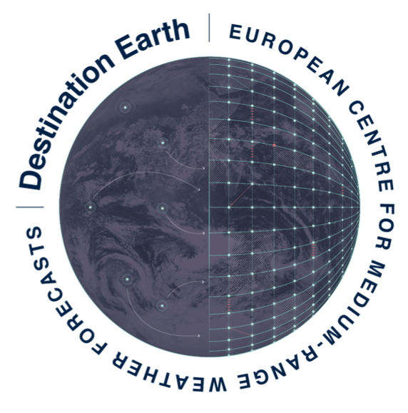

# Destination Earth Digital Twin Engine

!!! Warning
    **🚧 Work in progress!**

    

    

 
 

<!--  

  -->

Welcome to the ECMWF Digital Twin Engine documentation developers’ page. 

The European Centre for Medium-Range Weather Forecasts ECMWF is developing the Digital Twin Engine (DTE) in the frame of Destination Earth (DestinE), the ambitious initiative of the European Union to create digital twins of the Earth system.  

The DTE consists of the software infrastructure necessary for extreme-scale simulations, data fusion, data handling, and machine learning necessary to efficiently deploy and connect different digital twins with the overall DestinE platform. 

The opt-in DTE components are continuously evolving to comply with equally evolving standards on data access and data transformations and provide hooks for adaptors that facilitate interoperability. Meteorological data will comply with World Meteorological Organisation (WMO) data standards, in addition we seek to be INSPIRE compliant[1](#1), and follow as much as possible OGC standards to make location information and services FAIR – Findable, Accessible, Interoperable and Reusable. Some of the digital twin data will also comply with the directives on the availability of public datasets[2](#2). 

ECMWF  will contribute to the development and maintenance of efficient data access methods to such data and provide hooks to community-relevant connectors and be interoperable with other tools (e.g., CDO, CDS toolbox), community software platform (e.g. Pangeo) and infrastructure (Wekeo, EWC, etc.).  

Following the ECWMF 2022 software strategy, all DTE data handling and processing components are openly developed, fostering direct interactions with the community, and ensuring interoperability of standards, data formats and API’s. In addition, the development of DTE components will leverage community software stacks and contribute back to them. 

ECMWF is making available its software, with a proven track record, which is tested and continuously run in operational NWP, and is made available and further developed with community contributions to address the needs of the wider Earth System modelling and Earth observations community.   

### Intellectual Property Rights:  

This software is licensed under the terms of the Apache License Version 2.0 which can be obtained at [http://www.apache.org/licenses/LICENSE-2.0](http://www.apache.org/licenses/LICENSE-2.0). 

In applying this license, ECMWF does not waive the privileges and immunities granted to it by virtue of its status as an intergovernmental organisation nor does it submit to any jurisdiction. 

The core software has been developed by ECMWF through several projects with R&I co-funding from the European Commission.  

With the support of the European Union under the DestinE initiative, ECMWF will ensure the interoperability with the first developed DTs, will follow widely adopted standards for the DTE software development process, and consider a range of other publicly available Earth system software through the incorporation and/or development of suitable connectors. 

Enter the developers’ page [https://digital-twin-engine.readthedocs.io/en/latest/documentation/](documentation.md)

    

<i><small>This software is developed with co-funding by the European Union under the Destination Earth initiative.&nbsp;&nbsp;&nbsp;</small></i>

 [1] [https://inspire.ec.europa.eu/training/inspire-data-specifications](https://inspire.ec.europa.eu/training/inspire-data-specifications)

 [2] [https://digital-strategy.ec.europa.eu/en/news/commission-defines-high-value-datasets-be-made-available-re-use](https://digital-strategy.ec.europa.eu/en/news/commission-defines-high-value-datasets-be-made-available-re-use)
