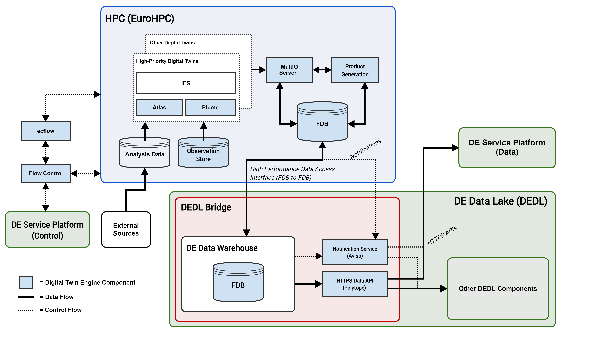

ECMWF's Digital Twin Engine
===========================

.. warning::
  Work in progress!

The Digital Twin Engine is a collection of components built to facilitate the implementation of Digital Twins. The digital twin engine has been developed at ECMWF as part of Destination Earth.

Documentation
-------------

* `multio <https://multio.readthedocs.io/en/latest/>`_
* `aviso <https://pyaviso.readthedocs.io/en/latest/>`_
* `polytope <https://polytope.readthedocs.io/en/latest/>`_
* `pyfdb <https://pyfdb.readthedocs.io/en/latest/>`_
* `atlas <https://sites.ecmwf.int/docs/atlas>`_
* `ecflow <https://ecflow.readthedocs.io/en/latest/index.html>`_
* `pyflow <https://sites.ecmwf.int/docs/pyflow/index.html>`_

.. warning::
  Full documentation coming soon!

* `fdb <https://github.com/ecmwf/fdb>`_
* `infero <https://infero.readthedocs.io/en/latest/>`_
* plume

Diagram
-------

Contact points:
---------------

 * Tiago Quintino
 * Simon Smart
 * James Hawkes

(firstname.lastname@ecmwf.int)
